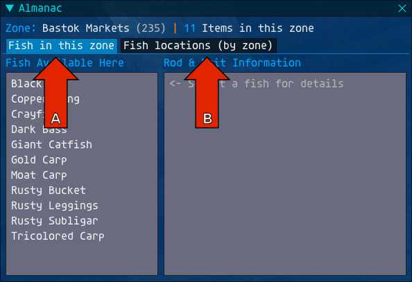
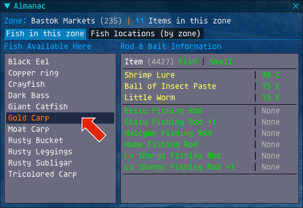
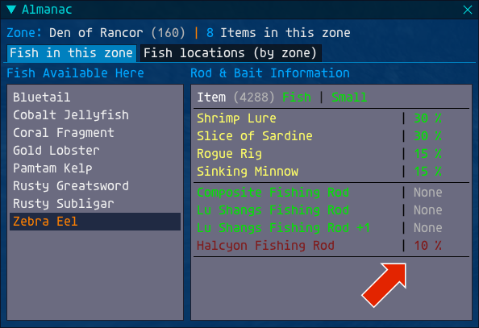
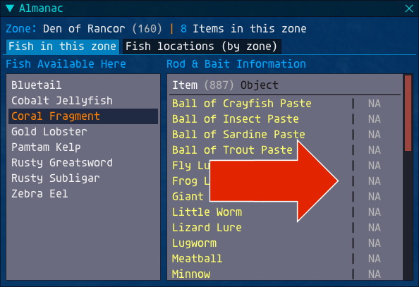
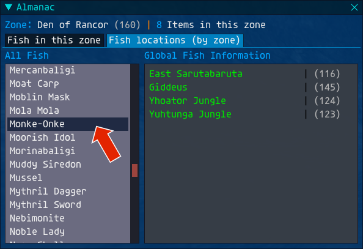

## Almanac

### User Guide
v 1.0

Almanac is an addon for Ashita that gives the player a lot of information about fish and where to find them.

The main interface is opened by typing the command ...

``` /faf ```
### 
The interface works in one of two modes, the mode is selected via the tabs as shown below ...

-   A) Shows the fish / objects available in the current zone
-   B) Shows all the fish in the game and where to find them
### 

###
The current zone, and the items in that zone, is always shown at the top of the panel.

In **Zone** mode, clicking on a fish will show information about the fish in the right panel ...
### 

###
Where a fish can break a rod it is highlighted as shown ...
### 

###
There is no luck involved in catching objects, but the bait that can be used is shown ...
### 

###
In Fish Location mode, all the fish in the game are listed. Clicking on one will show where that fish can be caught ...
### 

###
