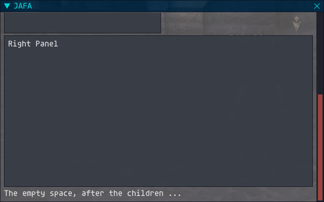

## JAFA

### Programmers' Guide
**Ver 1.0**

JAFA is an addon for Ashita v4. The purpose of this addon is to show how to build a basic addon and make use of **imgui** to display game information.
##
### A Brief Introduction to IMGUI


With Ashita v4, just about everything you might want to draw with your addon can be done using the **imgui** library. The library can be called from a variety of languages and Ashita v4 has hooks to allow it to be called from lua. It is important to note that not all features are available, imgui has moved on and the lua hooks have not kept up. You may find a useful feature in the imgui library, but when you try to call it the function pointer is nil, tripping the addon to a stop. So, buyer beware.

### It's All About Cycles

The main hook used by an addon for display purposes is the **'d3d_present'** callback. The game will render a frame, and, when it is finished, all of the addons will be called in turn so that they can draw over the top.

⭐ **Key Fact:** The key fact here is that there is no video memory. At the start of each cycle you will start with what is essentially a blank canvas. To make matters worse you can only paint with d3d primitives, fortunately imgui provides functions that act as an interface between your lua code and the low level d3d library.

You can have as many windows as you want, or none at all. Displaying lists of information, however, does lend itself to the window type display structure, just ask Microsoft. You just need to remember, you are NOT creating a window, you are painting something that looks and acts like a window, every single frame. If you want a child panel, draw one, but remember to paint your windows starting at the lowest level and build child objects upwards (to the top) of what you have already drawn. Fortunately the imgui commands make that the natural way to work.

Speaking of Microsoft, the windows you can paint have a lot in common with some of the standard Windows types, and where there is a similarity or a significant difference that you should be aware of I have identified it 📌 for your attention.
##
### A Brief Introduction to JAFA

JAFA doesn't really do anything, but hopefully it will help clarify how to build an addon and how to make use of imgui. To make this easier to follow you will find a folder called **Versions**. The version of JAFA in the base folder is the absolute basic addon that was used to make the **"Hello Vana'diel"** picture above, and I will explain the key parts of it in Chapter 1, but each subsequent chapter will add new features to the code that will be explained in detail. ⭐ The code for each chapter will be found in a sub folder with the chapter name.
##
### Chapter One - The Basics

To paint an empty window with imgui you only need the following commands ...

```	
if (imgui.Begin('JAFA')) then
    imgui.TextColored( { 0.9, 0.9, 0.9, 1.0 }, ('Hello Vana\'diel') )
    imgui.End()
end
```

Technically, you don't need the second line, but I've left that in so that I can explain a few things about it.

The Begin command creates a window. **EVERYTHING** about a window object in imgui has a default setting, and all of them can be changed. Settings are changed before the act, you push the new default for a setting, create your object, and, when you've finished with it, you pop the default, restoring the previous default. 

If you have, for example, three windows and you want them all to look the same, you pop the styles and colours **AFTER** the last window has been rendered.

This expands our code to the following ...

```
  imgui.PushStyleColor(ImGuiCol_WindowBg,         {0, 0.25, 0.50, .75})
  imgui.PushStyleColor(ImGuiCol_TitleBg,          {0, 0.05, 0.10, .7})
  imgui.PushStyleColor(ImGuiCol_TitleBgActive,    {0, 0.15, 0.25, .9})
  imgui.PushStyleColor(ImGuiCol_TitleBgCollapsed, {0, 0.25, 0.50, .4})
  imgui.PushStyleColor(ImGuiCol_Text,             {0, 0.90, 0.90, 0.90})

  if (imgui.Begin('JAFA')) then
      imgui.Text('Hello Vana\'diel')
      imgui.End()
  end

  imgui.PopStyleColor(5)
```

Each of the 5 lines at the top sets the default colour for an aspect of the window. There are dozens of them and I don't intend to list them all. ⭐ They can be found in the **imgui.lua** file in the **addons/libs** folder. The purpose of the ones I've included should be obvious.

You will see that I have used ...
```
  imgui.PopStyleColor(5)
```
You can pop a single item with ...
```
  imgui.PopStyleColor()
```
The design concept is to leave everything as you found it, i.e. empty the stacks (there are several) before you leave. I would hope, though I cannot prove, that imgui would manage any items you leave on the stack when you exit your function.

🔥 I have discovered that if you push 5 items and pop 6 items it will go bang, killing both your addon and **ALL** other addons currently running. **DON'T DO THIS**.
##
#### RGBA

You will have noticed that, by adding a default colour for text I was able to swap out the **TextColored** for a simpler **Text** that made use of the previously defined colour.

Colour in imgui consists of 4 values from 0 ~ 1 in a table ...

```
  {
    0.00,   0 red
    0.25,   25% green
    0.50,   50% blue
    0.75    75% alpha (transparency)
  }
```
A window or object with 0 alpha is invisible and an of alpha of 1 makes it fully opaque. This allows you to easily set the transparency of your addon such that the information can be seen without obscuring too much of the actual game.
##
#### Basic Window Functions

📌 The window created above has some basic functions that differ from a MS Windows window. 

- The window can be moved by clicking anywhere inside the window that is not an active widget (such as a button).
###
- The window can be collapsed (see the triangle icon at the top left)
###
- When a window is closed (see the X in the to right) it is not destroyed, it doesn't exist as such, this just hides the window (I will explain how below).


When a window is collapsed it is good practice to use a reduced level alpha, this allows the player to "store" the addon at the edge of the screen without having to unload it.
###
&nbsp;&nbsp;&nbsp;&nbsp;
##
#### Begin Parameters

In its simplest form the Begin function takes a single parameter, a string to identify the window. You can add up to two more, first is the shown state flag ...
```
if (imgui.Begin('JAFA', UIF.is_open)) then
```
the **is_open** variable is defined as a table near the top of the uif.lua file ...
```
local UIF = {
    is_open  = { true, },
    settings = settings.load(defaults),
}
```
If the user closes the window (using the X in the top right of the window) imgui sets the variable to the new state of the window, i.e. closed.

The first line in the render function ...
```
  if (not UIF.is_open[1]) then return end
```
prevents the window from being drawn when the variable is set to false. 📌 The window hasn't been destroyed, it never existed (this cycle), but we remember it fondly.

Luckily we have a way out ...
```
  if (args[1] == '/jafa') then
      UIF.is_open[1] = not UIF.is_open[1]
      UIF.SaveState(UIF.is_open[1])
  end
```
These lines are called when the **/jafa** command is typed on the chat line. This will toggle the variable back on, and, the next render cycle will draw it once more. The show state is put into the settings and saved for next run, but that will be covered in a later chapter.

If you have been looking at the definition for **Begin** you will have notice that there are additional parameters that can be used. Don't worry, these are covered in a later chapter.
##
### Chapter Two - Text Manipulation

If we change our text output by adding a new line we will see a fundamental aspect of window displays ...
```
  if (imgui.Begin('JAFA')) then
      imgui.TextColored( { 0.9, 0.9, 0.9, 1.0 }, 'Hello Vana\'diel' )
      imgui.TextColored( { 0.0, 0.9, 0.0, 1.0 }, 'You can log out any time you like,' )
      imgui.TextColored( { 0.9, 0.0, 0.0, 1.0 }, 'but you can never leave.' )
      imgui.End()
  end
```
What we see in our window is ...


What we learn from this is as follows ...

- Each text output will start a new line
- Text is automatically restricted to the window client area

The second aspect is useful, the cursor (which you never see) returned to the left edge of the next line automatically, like an old fashioned mechanical typewriter (remember them?).

If you want to paint more than one text item on the same line you can use ...
```
  imgui.SameLine()
```
This prevents the cursor from moving (much) before the next text command ...
```
  imgui.TextColored( { 0.0, 0.9, 0.0, 1.0 }, 'You can log out any time you like,' )
  imgui.SameLine()
  imgui.TextColored( { 0.9, 0.0, 0.0, 1.0 }, 'but you can never leave.' )
```


You will see that the equivalent of a space has been inserted between the two strings. In this case it's fine, but we don't always want this. Luckily we can perform more manipulation on the string and the cursor.
```
  imgui.TextColored( { 0.9, 0.9, 0.9, 1.0 }, 'Line 3' )
  imgui.SameLine()
  imgui.SetCursorPosX(imgui.GetCursorPosX()+100)
  imgui.TextColored( { 0.9, 0.9, 0.9, 1.0 }, 'Also Line 3' )
```
This adds a third line of text. After the first sentence we use **SameLine** to prevent the cursor from moving to the next line. The SetCursorPosX sets the cursor at the current location + 100. The second sentence is then displayed, 100 pixels further to the right ...


We can use **CalcTextSize** to find the width of a string ...
```
  imgui.TextColored( { 0.9, 0.9, 0.9, 1.0 }, 'Line f' )
  imgui.SameLine()
  local space = imgui.CalcTextSize(' ')
  imgui.SetCursorPosX(imgui.GetCursorPosX() - space)
  imgui.TextColored( { 0.9, 0.9, 0.9, 1.0 }, 'our' )
```


It's not perfect, but it makes the point.

Not surprisingly you can manipulate the cursor in both axis ...
```
  imgui.SetCursorPosX(200)
  imgui.SetCursorPosY(200)
  imgui.TextColored( { 0.9, 0.9, 0.9, 1.0 }, 'Somewhere in space ...' )
```


The cursor is moved to an absolute position in both axis based on the top left pixel the current window.

**NOTE ...**

- In this instance the window includes the title bar, and you cannot use **Text** or **TextColored** to paint there. Make sure that your Y axis is **BELOW** the bottom of the title bar.
##
### Chapter Three - Window Manipulation

For this chapter the UIF **Render** function has been reverted and now just consists of the following ...

```
  if (imgui.Begin('JAFA', UIF.is_open)) then

      imgui.TextColored( { 0.9, 0.9, 0.9, 1.0 }, 'Hello Vana\'diel' )
      imgui.End()

  end
```
I would draw your attention to the small triangle in the bottom right corner of the window ...


By default a main window is resizable, achieved my holding the triangle (let's call it the grip) and dragging. You can make the window almost disappear, and anything in the window is cropped, including the title bar ...


You can set the size of the new window by using the following command ...

```
  imgui.SetNextWindowSize({ 640, 400, })
```
You will notice that the size of the window is expressed as a table. The user can use the grip to make the window any size they want, only being restrained by the size of the view port.

By adding the following line ...
```
  imgui.SetNextWindowSizeConstraints({ 640 , 400, }, { FLT_MAX, FLT_MAX, })
```
we will limit the MINIMUM size of the window, the maximum can be anything (FLT_MAX resolves to -1).

This makes the **SetWindowSize** call redundant as the size of the window will be constrained by this function.

If we want to make the window resizable in a single axis we do the following ...
```
  imgui.SetNextWindowSizeConstraints({ 640 , 400, }, { 640, 600, })
```
The window can be sized down to 400, or up to 600 vertically, but is restrained horizontally. If you want the window to be resizable in this way it is important that you **DO NOT** use the **SetNextWindowSize** function. Remember, you paint the window from scratch every video cycle so your window will reset back to the original stated size, every time you try to change it.

If you want the window to be static you can add a flag when you create it ...
```
  imgui.Begin('JAFA', UIF.is_open, ImGuiWindowFlags_NoResize)
```
This prevents the grip from being shown and it will override the use of **SetNextWindowSizeConstraints**. ⭐ If you want to add creation flags there are dozens of them in the **imgui.lua** file in the **addons/libs** folder. 

You will notice that I have used the state feedback toggle (UIF.is_open). This is very important, if you remove this, or set it to a constant ...
```
  imgui.Begin('JAFA', 0, ImGuiWindowFlags_NoResize)
```
the creation flags are ignored.

For the purposes of the next bit I have made the window a bit smaller ...
```
  imgui.SetNextWindowSizeConstraints({ 320 , 200, }, { 320, 400, })
```
And, by the miracle of the for loop, added some exciting content ...
```
  for i = 1, 15 do
      imgui.SetCursorPosX(i * 10)
      imgui.TextColored( { 0.0, 0.9, 0.0, 1.0 }, ('Line %d'):fmt(i) )
  end
```


By dragging the grip you can dynamically change the vertical size of the window (the horizontal size is constrained) ...


The important thing to notice is that the window has automatically added a vertical scrolll bar when the size of the content exceeds the size of the current window boundary.

You can grab the scroll to access part of client area that is no longer being shown, or you can roll the mouse wheel over the window ...


Remember, the contents of the window are being painted (by you) every cycle and this will continue to update even if you are changing the size or aspect of the window at the time.
##
### Chapter Four - FFXI Access

For a lot of your composition you will be showing the content of local tables, for everything else there's **Ashita**.

There are a couple of ways you can access game data from an addon. The first is to intercept the data packets being sent between the client and the server. At the bottom of the **JAFA.lua** file we registered two functions to be called when a packet was sent or received in either direction.
```
  ashita.events.register('packet_in', 'packet_in_cb', UIF.packet_in)
  ashita.events.register('packet_out', 'packet_out_cb', UIF.packet_out)
```
We will make a few simple changes to these, currently empty functions. First we will add two new variables to the UIF data space ...
```
local UIF = {

  ... 

  InPacket  = 0,
  OutPacket = 0,
}
```
**NOTE ..** These are added at the bottom of the table so make sure you observer the commas.

Now we update the two functions ...
```
  function UIF.packet_in(Packet)
      UIF.InPacket = Packet.id
  end

  function UIF.packet_out(Packet)
      UIF.OutPacket = Packet.id
  end
```
In addition to **.id** you have access to **.size** and you can access specific bytes in the packet using ...
```
  Packet.data:byte(index, index)
```
where **index** is the byte offset into the packet (obviously you can use the same function call to obtain multiple bytes as this takes a start and end index).

Finally we have updated the body of our render funtion ...
```
  imgui.TextColored( { 0.9, 0.9, 0.9, 1.0 }, 'Hello Vana\'diel (Chapter 4)' )

  imgui.SetCursorPosY(100)
  imgui.TextColored( { 1.0, 1.0, 1.0, 1.0 }, 'In ...' )
  imgui.TextColored( { 0.0, 0.9, 0.0, 1.0 }, ('0x%.4X'):fmt(UIF.InPacket) )

  imgui.SetCursorPosY(200)
  imgui.TextColored( { 1.0, 1.0, 1.0, 1.0 }, 'Out ...' )
  imgui.TextColored( { 0.4, 0.4, 1.0, 1.0 }, ('0x%.4X'):fmt(UIF.OutPacket) )
```
When we run out addon we see ...


And yes, I changed the window background colour so that the blue and green would stand out. Before you ask, there is no packet zero sent to the client (⭐ green is typically used for packets **TO** the client and blue for packets **FROM** the client). I'm standing at the edge of a zone, so it's easy to provoke a packet storm, but first, another change.

I have added two more variables ...
```
  InCount   = 0,
  OutCount  = 0,
```
And updated them each time the packet in or out functions get called. Finally, I've added them to the render function ...
```
  imgui.SetCursorPosY(100)
  imgui.TextColored( { 1.0, 1.0, 1.0, 1.0 }, 'In ...' )
  imgui.SameLine()
  imgui.SetCursorPosX(120)
  imgui.TextColored( { 1.0, 1.0, 1.0, 1.0 }, 'Count ...' )

  imgui.TextColored( { 0.0, 0.9, 0.0, 1.0 }, ('0x%.4X'):fmt(UIF.InPacket) )
  imgui.SameLine()
  imgui.SetCursorPosX(120)
  imgui.TextColored( { 1.0, 0.4, 0.4, 1.0 }, ('%d'):fmt(UIF.InCount) )

  imgui.SetCursorPosY(200)
  imgui.TextColored( { 1.0, 1.0, 1.0, 1.0 }, 'Out ...' )
  imgui.SameLine()
  imgui.SetCursorPosX(120)
  imgui.TextColored( { 1.0, 1.0, 1.0, 1.0 }, 'Count ...' )

  imgui.TextColored( { 0.4, 0.4, 1.0, 1.0 }, ('0x%.4X'):fmt(UIF.OutPacket) )
  imgui.SameLine()
  imgui.SetCursorPosX(120)
  imgui.TextColored( { 1.0, 0.4, 0.4, 1.0 }, ('%d'):fmt(UIF.OutCount) )
```

Now, when we run the addon we see ...


Still no packets sent to the client, but we see that the **0x015** packet (Standard Client) is being sent several times every second. This is typical (we were surprised at the frequency and checked with retail, and 3 or 4 a second is typical, even when the player is idle).

So, I zoned again ...


The process of changing zone saw approximately 400 packets exchanged between the client and the server. Sobering thought. You will have noticed that the numbers continued to count even while the player was technically not connected (⭐ when a player zones he/she is disconnected from the server supporting the zone and logged into the server supporting the new zone, which may be a different computer or virtual machine). 

This has all sorts of issues, not least time synchronization. Lets assume you applied Protect and you expect it to last 30 minutes, but when you zone it suddenly jumps to 25 minutes remaining because the clock on the new zone server is behind. FFXI has lots of code (and packet data) to ensure that the transition between zones ***LOOKS*** like it's happening on the same machine, even if its not.
##
### Chapter Five - FFXI Access - Part 2

For this chapter I have deleted the variables and removed the render code, but I've kept the background colour and window size and format.

This chapter will show you how to obtain data from the Ashita core, the interface is quite consistent and, once you have managed to get one function to work you will find the rest to be fairly similar.

⭐ I would suggest (when you have finished reading this chapter) having a look at **Ashita.h** in **\plugins\sdk** folder as part of your Ashita 4 installation.

In brief, you need to identify the object interface that provides the data you want access to, and call it. I have added the logic to the render function to show the player's current position in X, Y and Z, for a change, picture first and then the code ...
###

```
  imgui.TextColored( { 0.9, 0.9, 0.9, 1.0 }, 'Hello Vana\'diel (Chapter 5)' )

  local entity = AshitaCore:GetMemoryManager():GetEntity()
  local party  = AshitaCore:GetMemoryManager():GetParty()
  local index  = party:GetMemberTargetIndex(0)

  imgui.SetCursorPosY(80)
  imgui.TextColored({ 0.7, 0.7, 0.7, 1.0 }, 'X:')
  imgui.SameLine()
  imgui.SetCursorPosX(40)
  imgui.TextColored({ 1.0, 1.0, 1.0, 1.0 }, ('%.4f'):fmt(entity:GetLocalPositionX(index)))

  imgui.SetCursorPosY(110)
  imgui.TextColored({ 0.7, 0.7, 0.7, 1.0 }, 'Y:')
  imgui.SameLine()
  imgui.SetCursorPosX(40)
  imgui.TextColored({ 1.0, 1.0, 1.0, 1.0 }, ('%.4f'):fmt(entity:GetLocalPositionY(index)))

  imgui.SetCursorPosY(140)
  imgui.TextColored({ 0.7, 0.7, 0.7, 1.0 }, 'Z:')
  imgui.SameLine()
  imgui.SetCursorPosX(40)
  imgui.TextColored({ 1.0, 1.0, 1.0, 1.0 }, ('%.4f'):fmt(entity:GetLocalPositionZ(index)))
```
The meat here are the three lines near the top. **AshitaCore** is your access to .. the **Ashita Core**, and this contains pointers to a variety of virtual objects, one of which being the **Memory Manager**. **GetMemoryManager()** gets you access to that, and finally we use that to get a pointer to the **IEntity** interface via **GetEntity**.

⭐ The key to take away from this is that you start at **AhitaCore** and work your way down the chain from one interface to the next. Only at the very bottom with **entity:GetLocalPositionX** do you get access to data for a specific object, in this case the players location.

It seems a bit contrary, but the zone index of the player is obtained by getting the zone index of the first player in the local party. This party will always exist, you don't need to actually form a party, and the player is always at index 0. There is also a **GetPlayer** interface, but that contains information about the player, such as job and level, not the environment, i.e. where the player is located.

⭐ You will often have to hunt around to find the right interface for the information that you need.

Now we will look a bit further out than the player (it's not always about me). I have added the following lines to the bottom of the **render** function ...
```
  --	Player's target

  imgui.SetCursorPosY(200)
  imgui.TextColored({ 0.7, 0.7, 0.7, 1.0 }, 'Target:')
  imgui.SameLine()
  imgui.SetCursorPosX(80)

  index = AshitaCore:GetMemoryManager():GetTarget():GetTargetIndex(0)
  name  = AshitaCore:GetMemoryManager():GetEntity():GetName(index)

  if nil ~= name then
      imgui.TextColored({ 1.0, 0.6, 0.0, 1.0 }, ('%s'):fmt(name) )
  else
      imgui.TextColored({ 1.0, 0.2, 0.2, 1.0 }, ('No Target') )
  end
```
###


🔥 It should be obvious, but I'm going to say it anyway. **ANYTHING** that Ashita returns to you should be tested before use. In this case we know that there is no target if the **name** returns a **nil**.


The core can be used to obtain a LOT of information, the code added below requests the job names from the core (this is extracted from the DAT files) ...
```
  imgui.SetCursorPosY(260)

  for i = 1, 30 do
      local Job = AshitaCore:GetResourceManager():GetString('jobs.names', i)
      if nil ~= Job then
          imgui.TextColored({ 1.0, 1.0, 1.0, 1.0 }, ('Job: %.2d'):fmt(i) )
          imgui.SameLine()
          imgui.TextColored({ 0.0, 1.0, 0.75, 1.0 }, ('%s'):fmt(Job) )
      end
  end
```
For the purposes of this lesson I am assuming that I have no idea how many jobs there are, and I'm going to test the pointers, so I should be safe?


This looks good, and it demonstrates the window allowing data to be printed beyond its vertical boundary and automatically adding a vertical scroll.

So, we scroll ...


🔥 Opps. The KGB used to say ***"Trust, but verify"*** (Regan thought he invented this, but he didn't). Anything that is returned from **SE** (via the DAT files or otherwise) should be verified. If we know that 22 is the last job, then restrict your code accordingly.

**NOTES ..** 

- The code in the Chapter 5 folder is corrected.
###
- The strings that can be requested are defined in **.\config\ashita\ashita.datmap.ini** in your Ashita installation.
##
On last piece of information in this chapter. I have added a few lines to the bottom of the render function ...
```
  local resource = AshitaCore:GetResourceManager():GetItemById(19321)

  if nil ~= resource then
      imgui.TextColored({ 1.0, 1.0, 1.0, 1.0 }, ('Item 19321:') )
      imgui.SameLine()
      imgui.TextColored({ 0.0, 1.0, 0.0, 1.0 }, ('%s'):fmt(resource.Name[0]) )
  end
```
The ashita.h file contains the definition of the resource object returned by the **GetItemByID** call, it contains the following ..
```
  const char* Name[3]; // The items name. (0 = Default, 1 = Japanese, 2 = English)
```
My resource object returned a valid object, but my output is ...


⭐ While the **.h** file would imply a **C** interface, the final layer is **lua** and so arrays are 1 based, not 0 based. Changing the code to ...
```
  imgui.TextColored({ 0.0, 1.0, 0.0, 1.0 }, ('%s'):fmt(resource.Name[1]) )
```
Gives us the output we expected ...


You will have remembered using ...
```
  GetTargetIndex(0)
```
So you will need to ne aware of when you need to use a zero as a parameter, and when to use 1 as as base offset in an array.
##
### Chapter Six - Children Are The Future

So far, everything we have painted has been in a single window. For this chapter we will look at child windows. First I have reverted the window back to a simpler form ...


I'm going to add 8 (eight) lines and change everything ...
```
  imgui.BeginChild('LeftPanel', { 310, 300, }, true)
  imgui.TextColored( { 0.9, 0.9, 0.9, 1.0 }, 'Left Panel' )
  imgui.EndChild()

  imgui.SameLine()

  imgui.BeginChild('RightPanel', { 0, 300, }, true)
  imgui.TextColored( { 0.9, 0.9, 0.9, 1.0 }, 'Right Panel' )
  imgui.EndChild()

  imgui.TextColored( { 0.9, 0.9, 0.9, 1.0 }, 'The empty space, after the children ...' )
```
This is what we now have ...


This one picture tells us a lot. The two values in **BeginChild** define the size of the window in X and Y. The second window has a width of 0, telling imgui to use all the remaining space.

You will have noticed that the two child windows are side by side on the same line. If we comment out the **SameLine** command we get this ...


The 0 parameter means that the second window occupies the whole width of the parent. Scrolling down will show the bottom of the window and anything added after ...



The width of the second child window is adjusted down to allow for the vertical scroll. The size of the outer, parent window, is not affected.

Having put the SameLine command back, I have added some content to one of the windows ...
```
  imgui.BeginChild('LeftPanel', { 310, 300, }, true)
  imgui.TextColored( { 0.9, 0.9, 0.9, 1.0 }, 'Left Panel' )

  for i = 1, 15 do
      imgui.SetCursorPosX(i * 10)
      imgui.TextColored( { 0.0, 0.9, 0.0, 1.0 }, ('Line %d'):fmt(i) )
  end

  imgui.EndChild()
```


As you can see, the content is clipped to the size of the window and a scroll bar has been added to allow you to access all the content.

We used **ImGuiCol_WindowBg** to set the background colour of the parent window, we can use **ImGuiCol_ChildBg** to set the child background ...
```
  imgui.PushStyleColor(ImGuiCol_ChildBg, {0.4, 0.4, 0.4, 0.0})
  imgui.TextColored( { 0.9, 0.9, 0.9, 1.0 }, 'Hello Vana\'diel (Chapter 6)' )

  imgui.BeginChild('LeftPanel', { 310, 300, }, true)
  
      imgui.TextColored( { 0.9, 0.9, 0.9, 1.0 }, 'Left Panel' )

      for i = 1, 15 do
          imgui.SetCursorPosX(i * 10)
          imgui.TextColored( { 0.0, 0.9, 0.0, 1.0 }, ('Line %d'):fmt(i) )
      end

  imgui.EndChild()
  imgui.PopStyleColor()
```
You may have noticed that the child windows were dark and opaque, this is the effect of the alpha setting in the child window style, but we can change that with the **ImGuiCol_ChildBg** option above, remember, once the window has completed painting we need to pop the child window style ...


The way that the alphas combine can seem complicated. For the purposes of the image below the parent window was set to 0.5 and the three child window settings were 0.25, 0.5 and 0.75 ...


The images are in the same folder as the manual if you want to examine them in greater detail. Remember, the screen is rendered with D3D and so the rules are the same for imgui as they are for the game.

I can add more children, inside an existing child, as long as I do it before I use **EndChild**
```
  imgui.BeginChild('RightPanel', { 0, 300, }, true)

      imgui.TextColored( { 0.9, 0.9, 0.9, 1.0 }, 'Right Panel' )

      imgui.PushStyleColor(ImGuiCol_ChildBg, 	{0.4, 0.4, 0.4, 0.25})

      imgui.BeginChild('RightPanelA', { 140, 100, }, true)
          imgui.TextColored( { 1.0, 0.4, 0.4, 1.0 }, 'RA' )
      imgui.EndChild()

      imgui.SameLine()

      imgui.BeginChild('RightPanelB', { 0, 100, }, true)
          imgui.TextColored( { 0.0, 1.0, 0.0, 1.0 }, 'RB' )
      imgui.EndChild()

      imgui.PopStyleColor()

  imgui.EndChild()
```


You are probably wondering how deep this rabbit hole is, and while I don't know for sure, I would imaging you could keep adding child windows until you run out of pixels.
##
### Chapter Seven - Putting The Children To Work

So far the child windows have been mostly pointless, but there are a number of styles that can be used to great effect and this chapter will cover one of them, but there will be more later.

Once more the window has been reverted as we will be adding different objects this time. The render function now contains ...
```
  imgui.SetNextWindowSizeConstraints({ 640 , 400, }, { 640, 400, })

  if (imgui.Begin('JAFA', UIF.is_open, ImGuiWindowFlags_NoResize)) then

      if imgui.BeginTable("table1", 3, ImGuiTableFlags_Borders + ImGuiTableFlags_RowBg) then

          imgui.TableSetupColumn("1", ImGuiTableColumnFlags_WidthFixed, 125)
          imgui.TableSetupColumn("2", ImGuiTableColumnFlags_WidthFixed, 125)

          imgui.EndTable()

      end

  end
```
We have created a table at the current cursor position ...


Now that is probably not what you expected, but it's what you get if you create a table but don't put any data in it.

**NOTE ...**

- There are several ways to build a table window, I find this one the most convenient, but take a look at the imgui demo to see other ways to approach this task.

I have added some data ...
```
  for i = 1, 9 do

      imgui.TableNextRow()

      imgui.TableSetColumnIndex(0)
      imgui.TextColored({ 0.9, 0.9, 0.9, 1.0 }, ('%d x 1'):fmt(i) )

      imgui.TableSetColumnIndex(1)
      imgui.TextColored({ 0.9, 0.9, 0.9, 1.0 }, ('%d x 2'):fmt(i) )

      imgui.TableSetColumnIndex(2)
      imgui.TextColored({ 0.9, 0.9, 0.9, 1.0 }, ('%d x 3'):fmt(i) )

  end
```


You will notice that, to create a new row you need to call **TableNextRow**, this will add a new row to the bottom of the table. You can select a column using **TableSetColumnIndex**

The table uses alternating colours to highlight the different rows, this style can be changed, just like most things.

If the table grows beyond the size of the window a scroll bar is added to the window ...


You could put the table inside a child window ...


There are options that will remove the border, how it ends up looking is very much your choice.
##
### Chapter Eight - Widgets

Before we go any further you need to know about widgets. There are a few that can significantly change the look and functionality of your interface. Once again JAFA is being reset to a basic empty window.

