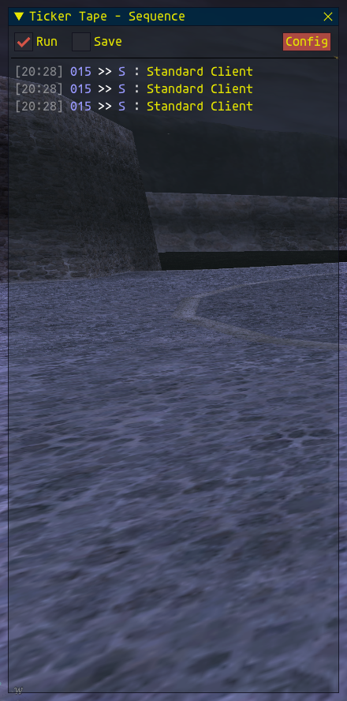

## TickerTape Version 1.0 (August 2024)

### Introduction

***Ticker Tape*** is a packet capture addon for Ashita v4, it is used to capture and view packets sent between a FFXI Server and the Client program. The addon will show you the last two dozen packets as a real-time updating list. You can pause the list at any time and select individual packets to view in detail.

Ticker Tape will save packets to file for offline analysis, this is independent of the real-time packet viewing.

Because Ticker Tape relies on community information the bit patterns may or may not be 100% accurate for any given server, it has been tested on the August 2024 LSB server.

### Installation

To install the addon make a copy of everything here, including the /DATA folder. It would be a good idea to copy the /MANUAL folder for future reference.
If you want to auto-load the addon you will need to add it to the ***default.txt*** script.

### First Run

When you start Ticker Tape you will see the ***Sequencer*** window ...
### 

###
If the window does not appear you can use the command line ...

```/tt show```

This is a toggle and can be used to show / hide the windows at any time without interfering with the operation of the packet capture.

