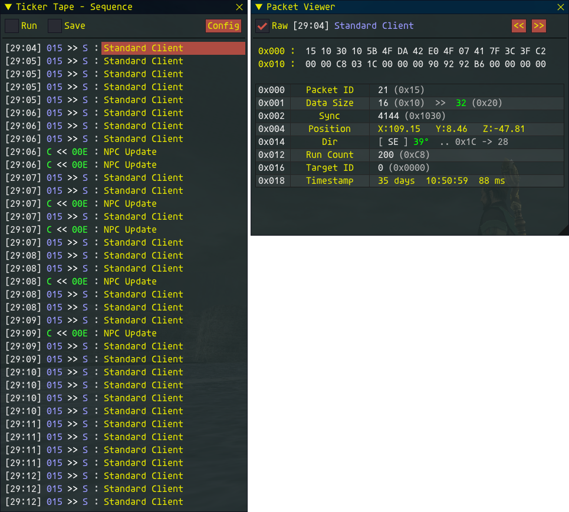
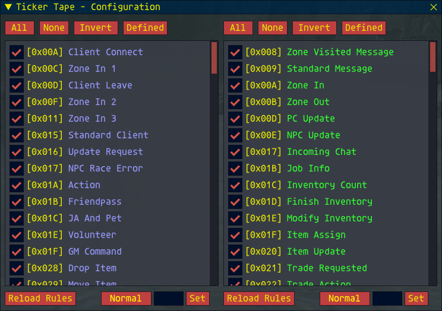
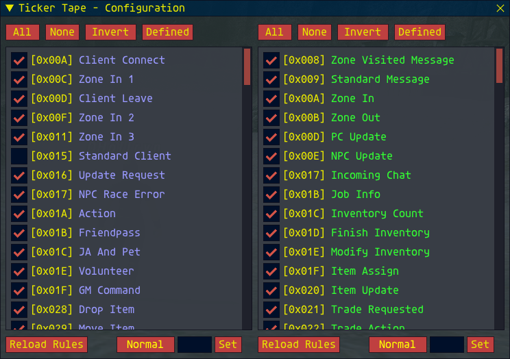
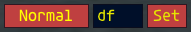

## TickerTape Version 1.0 (September 2024)

### Introduction

***Ticker Tape*** is a packet capture addon for Ashita v4, it is used to capture and view packets sent between a FFXI Server and the Client program. The addon will show you the last 36 (thirty-six) packets as a real-time updating list, or ticker tape. You can pause the list at any time and select individual packets to view in detail.

Ticker Tape can also be used to save packets to file for offline analysis, this is independent of the real-time packet viewing.

Packet decoding is accomplished via a pair of files containing decode rule. At the time of writing this manual a significant number of packets still need to be decoded. Ticker Tape was written to fill my need to see packets in real time, so I am adding new packet definitions as I need them. This is an ongoing process and new definitions will continue to be added over time. 

Because Ticker Tape relies on community information the bit patterns may or may not be 100% accurate for any given server, it has, however, been tested on the August 2024 LSB server.
##
### Installation

To install the addon make a copy of everything here, including the /DATA folder. It would be a good idea to copy the /MANUAL folder for future reference.

If you want to auto-load the addon you will need to add it to the ***default.txt*** script. I do, however, recommend loading the addon manually once the game client has loaded. This allows the addon to load/save settings between runs. This is a known bug that I will fix at some point. 
##
### First Run

When you start Ticker Tape you will see the (mostly empty) ***Sequencer*** window ...
### 

###
If the window does not appear you can use the command line ...

```/tt show```

This is a toggle and can be used to show / hide the windows at any time without interfering with the operation of the packet capture.

You will see the packets streaming from the top of the window to the bottom, and then scrolling with the newest packet at the bottom of the window. While in ***run mode*** (see the tick in the box at the very top left) the window background is almost transparent minimizing the amount of the game information being obscured, while still showing the sequence of packets flowing from the game.

Each line has four (4) pieces of information ...
### 

###
**A)** Is the time (min:sec) when the packet arrival, **B)** Is the ID (in Hex) of the packet, **C)** The direction of travel (this example is from the Client to the Server, called an ***OUT*** packet) and finally **D)** The type of packet.

The example below shows a packet traveling from the Server to the Client. The Blue / Green colour coding is a standard for FFXI packets ...
### 

###
If you want to view the contents of a packet you can click on the Run button at the top left of the window which will stop the sequencer. Alternatively you can use the command ...

```/tt run```

to toggle **Run Mode** on / off.

When Run Mode is off the Packet Viewer window is opened, this is initially empty. To view a packet select the packet name (the yellow part) in the Sequence list ...
### 

###
You can change the displayed packet at any time by selecting a different packet in the Sequencer list, or by means of the **Previous** "<<" and **Next** ">>" buttons at the top right of the Packet Viewer window.

You will see that the Packet Viewer is split into two sections with the top of the window showing the raw hex data and the bottom part showing the decoded data in the packet.

If you don't want to see the hex, maybe it takes up too much space, or isn't helpful, you can disable it by clicking the **Raw** button at the top left of the Packet Viewer window.

This is especially useful in complex packets that would otherwise scroll ...
### 

###
You will notice a tab at the bottom right of the Packet Viewer ...
### 

###
This allows the Packet Viewer window to be resized (vertically) as needed (it is locked horizontally).
##
### Filter

Some packets are sent quite frequently and, as long as you are not interested in them, can clutter the Sequencer list. Fortunately there is a way to hide these unwanted packets. Click on the **Config** button, at the top right of the Sequence window. 

A new window will open listing all of the packets, in two tables, Out and In ...
### 

###
You can deselect any packet in these lists and the packet will no longer appear in the Sequencer.
### 

###

**NOTE ...** 

- The addon will remember your settings between runs (You should manually load the addon to make use of this feature).
###
- A packet that is disabled in this way will still be saved as part of a packet capture (see below).
###
- A packet that is disabled in this way can still be used as a trigger (see below).
##
Both the Out and In list have buttons above them that allow you to make mass selections ...

|Button|Effect|
|:---:|:---|
||All packets (in this direction) will be enabled|
||All packets (in this direction) will be disabled|
||Invert the state of all packets. Enabled packets will be disabled and disabled packets will be enabled|
||Packets that have a rule will be enabled, packets that don't have a rule will be disabled|
###
The last option is useful when you are adding new packet definitions to the rules file (thank you if you are).
##
### Triggering

It is often the case that a packet you want to view is lost in the volume of packets sent. This is especially true when changing zone when between found and five **hundred** packets may be transferred. Using the trigger system allows you a way to catch the packet you are after.

There is a trigger section at the bottom of each list (you can have a different trigger on In and Out and both can run at the same time) ...
###

###
For the purposes of this guide I want to look at the ***Inbound*** packet with the ID **0X0DF** (Char Update). I know that this packet is sent when zoning, but it gets lost.

I will put the In the small edit field. Case doesn't matter and all input is considered to be hex so you can just put in **df** ...
###

###
Next click on the button to the left, this will cycle through the following modes ...

|Button|Effect|
|:---:|:---|
||The trigger system is OFF|
||When not running, the system will switch Run Mode **ON** when the identified packet is received|
||When running, the system will switch Run Mode **OFF** when the identified packet is received|
||When not running, the system will switch Run Mode **ON** when the identified packet is received and switch it **OFF** again 18 packets later|
###
We want to stop running when the packet is detected so toggle the button ...
###

###
Make sure that the sequencer is in Run Mode and click the **Set** button ...
###

###
The mode button will change to show that triggering is active, you will also notice that the trigger packet is identified in the appropriate list.

So, now zone ...
###

###
The trigger controls will reset, the sequence will stop Run Mode and the packet we want will be at the bottom of the list.

**Burst ON** is a bit different in that, you start with Run Mode **OFF**. Once the packet is detected Run Mode will switch ON for 18 packets and then switch OFF again.

As soon as you click on the **Set** button you will see the Sequence become active, but the check box will still show it to be disabled. This is to allow the sequencer to capture the packets immediately before the trigger packet. Once triggered, the sequencer will capture an additional 18 packets (total from IN and OUT) and then stop ...
###

###
This allows you to see the packets just before and just after the trigger packet.

To turn off the trigger mode (if you changed your mind) you can click on the trigger mode button, or the Set button a second time.
##
### Reloading Rules

If you are editing a display rule it can be a pain when the packet is rare and hard to catch, the last thing you want to do is unload the addon, edit the definition and reload it and then hunt for the packet again

Fortunately you can edit the definition while the addon is running and then click on the **Reload Rules** button to reload the appropriate definition list.

While the addon tries to protect itself, it is STRONGLY suggested that you turn off Run Mode before you reload the rules. As you will be examining a packet this will usually be the case anyway.

##
### Capture

To capture data for offline analysis click the **Save** button at the top of the Sequence window. The name of the file will be shown in the top section of the window ...
### 

###
**NOTE ...** 

- The addon does not need to be in Run Mode for it to capture packets to disk, this function is independent of all other features.
###
- The addon will save files in the **/captures** folder, which it will make for you if it doesn't already exist.
###
- Packets that have been disabled in the Sequencer will still be saved by this process.
###
- You can start / stop the packet capture using the ```/tt save``` toggle.
##
### Questions

**Q:** Why Ashita v4 and not Windower?
**A:** There are good quality packet capture addons for Windower and I have no desire to duplicate anyone elses work.
###
**Q:** Why Ashita v4 and not v3?
**A:** If you are using Ashita you should move to v4. I know it is still classed as a Beta but it is significantly more advanced as a platform than v3. Just upgrade and be done with it.
###
**Q:** Why does it show "**No Rules**" in the Packet Viewer window?
**A:** I have released the code because it is in a usable state (not to say there are no bugs, there probably are). The addon has two tables of "rules" that are used to decode the packets. The packet you are looking at is not in either list (I am still adding them).


You have two options ...

- You can edit the rule table yourself, the [Programmers Guide](Prog.MD) will help you.
- You can send me a message and I will try to add the missing rule for you.
##
##
***D'Hoffryn***
2024

