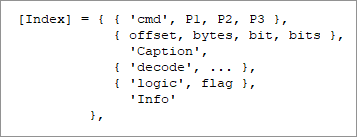
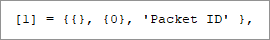
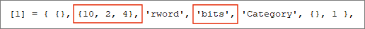
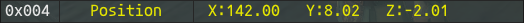
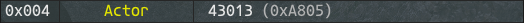

## TickerTape Version 1.0 (September 2024)

### Programmers' Guide

***Ticker Tape*** relies on two rules files to decode the packets to and from the server. This document explains how these rules files are constructed.

- /Data/RulesIn.lua
    - Definition of packets TO the client
###
- /Data/RulesOut.lua
    - Definition of packets FROM the client

These files can be edited (in an editor of your choice) to add new packets to the decode list, or to correct mistakes I may have made. In its simplest form, a packet rule is a lua table containing a sequence of nested tables of instructions that are executed in turn ... 
### 

###
## Overview

The rule is indexed as shown below, and while you can use decimal or hex I would recommend using the hex ID for the packet. Remember, there are many instances of a packet with the same ID being used (with different meaning) in both directions, so make sure you are working with the right packet, **in** or **out** ...
### 

###
Each line of the rule (each table) is executed in turn, from top to bottom (there are control sequence commands that are covered later). Each rule is organised such that the most important information, elements that are always present, are at the left of the table. This allows you to ignore elements at the end of the table that are not always needed. A FULL line is shown below ...
### 

###
This may look overwhelming, but going back to the original example ...
### 

###
This is used to display the line below ...
### 

###
The first table is empty (we have no special commands), the second table just contains the byte offset in the packet (0). We only want to access a single byte which is shown as a raw value (raw values are displayed in decimal and hex). Finally the caption, **Packet ID** tells the user what is being shown.

It is important that you make sure the line index is ...
- In order
- Has no gaps

This is a limitation of the way lua indexes tables, and yes, I know that I could fix this, and I may at some point, but for now use, [1], [2], [3] etc.

Anything in quotes (you can use single or double) is case sensitive. **ALL** commands are in lower case.

The rest of this guide explains how to construct the lines needed to decode a packet. There is a lot of information in this guide, so you can use this table of links for future access.
###
|Section|Detail|
|:---:|:---|
|[Data Offset](#data-offset)|How to identify the data in the packet we want to use|
|[Data Format](#data-format)|The bit, byte and word layout|
|[Data Decode](#data-decode)|How the data is interpreted|

##
### Data Offset
### 

###
In most cases, such as in the original example, the offset into the packet is a single number, this can be expressed as decimal or hex.

There are cases where the entire byte or value is not used, in which case, there are two ways in which this section can be used to define the value to be used ...

- A single bit at a given bit offset within the data
- A group of bits from a given start bit

The type used is based on the **format** as shown in the following examples ...
### 

###
When the **format** is **bit** the offset is used to extract a single byte (at the specified offset) and the bit with the specific value is extracted from the byte ...
### 

###
Using bits as flags is covered later, but this example shows the *bit with the value 4* has been extracted from the byte (**NOT** the 4th bit).

The alternative use is when multiple bits need to be extracted from the middle of a byte or word, etc, and used as a number ...
### 

###
Here, a reverse word (little endian) is extracted from the data. The bottom 2 bits are discarded (shift right) and the next 4 bits are used as the value ...
### 

###
In this example, the two bytes are extracted to form the value 0x1618 or ...

-   0001 0110 0001 1000

The bottom 2 bits are discarded ...

-   00 0101 1000 0110

From which we take the bottom 4 bits to form our value ...
### 

###
When the **bits** decode the bits extracted are shown as a range like [02 ~ 05] above, meaning the value is constructed from bits 2 to 5 inclusive.
##
### Data Format
### 

###
The data format can be one of the following ...
###
- byte
    - a single byte is extracted at the given location
###
- word
    - two bytes are extracted starting at the given location and used in ***big endian*** format.
###
- rword (reverse word)
    - two bytes are extracted starting at the given location and used in ***little endian*** format.
###
- dword (double word)
    - four bytes are extracted starting at the given location and used in ***big endian*** format.
###
- rdword (reverse double word)
    - four bytes are extracted starting at the given location and used in ***little endian*** format.
##
### Data Decode
### 

###
While it is often enough to look at the raw value from the packet, sometimes it is helpful to see a decoded, or at least partially decoded interpretation of the data. The data **decode** can be one of the following, listed below in no particular order (an example can be seen by following the link) ...
###
|Type|Purpose|
|:---:|:---|
|[bool](#bool)|A series of bits shown as 1 or 0|
|action|An action performed by a player or NPC|
|[merit](#merit)|The name of a merit by its ID|
|[jpoint](#jpoint)|The description of an ability by its Job Point ID|
|[xyz](#xyz)|A location in +/- X, Y, Z|
|[item](#item)|An item name from its ID|
|[store](#store)|A storage location from its ID|
|[ip](#ip)|An IP address|
|vdate|A date in Vana'Diel|
|[entity](#entity)|An entity by its full ID|
|[eid](#eid)|An entity by its local ID/index|
|[job](#job)|A job / sub job based on ID|
|[dir](#dir)|A direction as an angle and text|
|bits|
|[craft](#craft)|A craft based on its ID|
|string|A display string|
|info|Decode information (user info)|
|bluspell|A BLU spell based on its encoded short ID|
|attach|An automation attachment name based on its Sub ID|
|time|
|psize|
##
#### Examples ...
###
### bool
A **bool** type is usually used with a **flag**, flags are covered in a later section, this section explains how a bool is displayed.
### 

###
This sequence from the packet decode for an NPC update (packet IN 0x00E) contains 4 bit flags that identify which additional data in the packet is valid. If the specified bit (the bit with the stated value) is set then the **extra** data (a string) is shown in green, otherwise it is shown in grey ...
### 

###
The eight (8) bits are shown in order and are grey if not tested. If a bit is tested and it is set it is shown in green, if it is tested and it is not set then it is shown in red.
###
### merit
A **merit** type converts an ID into a textual description of that merit ...
### 

###
Merit IDs are decoded from an internal table. A merit will always be contain in a rword type.
### jpoint
A **jpoint** type converts an ID into a textual description of a job point and decodes its current state ...
### 

###
Job Points are decoded from an internal table and will always be contained in a rword type.

Job point IDs do NOT follow the same order that they are listed by the cient and so often appear "out of order" in the packet. The **Lv** or level shows how many points have been spent on that ability, **Next** shows how much the next upgrade will cost. If Next is 0 then the ability is fully upgraded.
### xyz
An **xyz** type takes the values in 12 consecutive bytes and converts them into 3 floating point numbers that represent X, Y and Z coordinates ...
### 

###
This is one instance where the stated data source format is ignored, I don't know the correct name for a triple reverse dword.
### item
An **item** type takes the values from the packet and looks up the item with that ID ...
### 

###
The information is extracted by making a call to the Ashita core.
### store
A **store** type typically takes a single byte and converts it into a storage location ...
### 

###
The location is converted using an internal lookup table.
### ip
An **ip** type takes four consective bytes and converts it into an IP address ...
### 

###
The address is commonly used by packets that are sent and received during the process of zone changing. It is commonly seen with the port address which is shown as a raw value ...
### 

###
### entity
An **entity** can be an NPC, or monster or even a pet. Its ID occupied a four byte rdword and this type converts this ID into a name ...
### 

###
NPCs are allocated a band of 4096 entries per zone, so the ID equates to the zone x 4096 plus an index in the range 0 ~ 4095. For reasons best known to SE you often see both in the same packet, even though the index could easily be extracted directly from the ID.

The name of the entity (if available) is found by calling the Ashita core.
### eid
An **eid** takes an "index in zone" and tries to find the ID of the entity ...
### 

###
This is not always possible, if it is, the name is shown, otherwise the ID is shown (as in the example above). If the **eid** yields a valid index it is identified via a call to the Ashita core.
### job
A **job** entry is always a single byte that is decoded into text ...
### 

###
A job and sub job are usually in the same packet and use the same decode. The job text is decoded from a local lookup table.
### dir
A **dir** entry is always a single byte that is decoded into the direction that a given entity is facing ...
### 

###
The direction is given as text and an angle. FFXI uses a system where 0 degrees is East and the angle is calculated clockwise.
### craft
A **craft** entry decodes the craft skill type as text and extracts the current rank and level as numbers ...
### 

###

