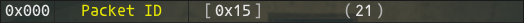

## TickerTape Version 1.0 (September 2024)

### Programmers' Guide

***Ticker Tape*** relies on two rules files to decode the packets to and from the server. This document explains how these rules files are constructed.

- /Data/RulesIn.lua
    - Definition of packets **TO** the client
###
- /Data/RulesOut.lua
    - Definition of packets **FROM** the client

These files can be edited (in an editor of your choice) to add new packets to the decode list, or to correct mistakes I may have made. In its simplest form, a packet rule is a lua table containing a sequence of nested tables of instructions that are executed in turn, using the index to control the display order ... 
### 

###
## Overview
###
The rule is indexed as shown below, and while you can use decimal or hex I would recommend using the hex ID for the packet. Remember, there are many instances of a packet with the same ID being used (with different meaning) in both directions, so make sure you are working with the right packet, **in** or **out** ...
### 

###
Each line of the rule (each table) is executed in turn, from lowest index to highest index (there are control sequence commands that are covered later). Each rule is organised such that the most important information, elements that are always present, are at the start of the table. This allows you to ignore elements at the end of the table that are not always needed. A FULL line is shown below ...
### 

###
This may look overwhelming, but going back to the original example ...
### 

###
This is used to display the line below ...
### 

###
The first table is empty (we don't need any flow control commands), the second table just contains the byte offset in the packet (0). We only want to access a single byte which is shown as a raw value. If a **decode** section is not included it is assumed that you want to show the raw value. 

Raw values are always displayed in hex, [inside square brackets], and decimal, (inside round brackets) so we don't need a **decode** section in this instance. Finally the caption, **Packet ID** tells the user what is being shown. 

A very high percentage of data content can be displayed as simply as this. There are exceptions, and they can be extremely complex, but there are tools the help you.

It is important that you make sure the line index is ...
- In order
- Has no duplicates

This is a limitation of the way lua indexes tables, if you have two lines with the same index one of them will be ignored. If you have them in the wrong order they will be executed out of order, which, while it will still probably work, will be confusing.

You **DO NOT** need to decode the packet in order. In many cases SE has put a value at the end of the packet (probably as an afterthought) that is better off shown at the start. You can decode the packet in any order that you want.

Anything in quotes (you can use single or double) is case sensitive. **ALL** commands are in lower case. You can, however, use the flag IDs as upper or lower case (more about flags later).

The rest of this guide explains how to construct the instruction lines needed to decode a packet. As there is a lot of information in this guide you can use this table to quickly access the later sections.
###
|Section|Detail|
|:---:|:---|
|[Data Offset](#data-offset)|How to identify the data in the packet we want to use|
|[Data Decode](#data-decode)|How the data is interpreted|
|[Info](#info-1)|Additional text display|
|[Flow Control](#flow-control)|Loops, Calls etc|
|[Data Flags](#data-flags)|Complex flow control|
##
## Data Offset
### 

###
In most cases, such as in the original example, the **offset** into the packet is a single number, this can be expressed as decimal or hex.

If more than 1 byte is used, the **bytes** value is used to identify how many bytes are to be read from the packet at the offset location.

There are cases where the entire byte or value is not used, in which case the **start bit** is identified (this is from 0 ~ 7) and the number of **bits** to use will be the last variable. If the number of bits is not supplied it is implied by the number of bytes requested, i.e. 3 bytes would result in 24 bits being used. If a start bit is not supplied it is assumed that data is extracted from the first bit (bit 0).
### 

###
The packet size above is a perfect example. The first bit of the second byte is not part of the size, so we read 7 bits starting at bit 1. Using packet x15 as an example, the first two bytes are ...

-   x15
-   x10

or

-   0001 0101
-   0001 0000

FFXI reads bits sequentially from the packet in reverse bit order, i.e. in the example above, the second byte would be read as ...

-   0 : **0** : **0** : **0** : **1** : **0** : **0** : **0**

We take the byte at offset 1, ignore the first, or bottom bit, leaving us with the value 8.
### 

###
As you can see from the output, the value is further processed (the packet sizes are multipled by 4) and this is handled by the **decode** section.

In some cases the client will memory move a block of data from the packet. When that occurs the data will have been put into the packet in the required order. You need to be aware of which unpack strategy the client is using for a given packet.

For complex unpacking strategies you can use the flag system to access the data. This is covered later in this document.
##
## Data Decode
### 

###
While it is often enough to look at the raw value from the packet, sometimes it is helpful to see a decoded, or at least partially decoded interpretation of the data. The data **decode** section is a table and can contain up to 4 of the following strategies. When no **decode** table is provided the code assumes the **'raw'** strategy is to be used. Remember to put the strings in braces, if this is not entered as a table it will not be executed. In many cases you can follow the link for an example ...
###
|Type|Purpose|
|:---:|:---|
|[time](#)|A Timestamp (h,m,s)|
|[mstime](#)|A Timestamp (h,m,s ms)|
|[xyz](#xyz)|A location in +/- X, Y, Z|
|[dir](#dir)|A direction as an angle and text|
|[psize](#psize)|Display the corrected packet size|
|[eid](#eid)|An entity by its local ID/index|
|[entity](#entity)|An entity by its full ID|
|raw|The data as hex and decimal|
|[string](#string)|A display string|
|[music](#)||
|[weather](#)||
|[zone](#)||
|[house](#)||
|[bitflag](#bitflag)|A series of bits shown as 1 or 0|
|[ip](#ip)|An IP address|
|[store](#store)|A storage location from its ID|
|[item](#item)|An item name from its ID|
|[exdata](#)||
|[ability](#)||
|[info](#)||
|[vdate](#)|A date in Vana'Diel|
|[jpoint](#jpoint)|The description of an ability by its Job Point ID|
|[merit](#merit)|The name of a merit by its ID|
|[geo](#)||
|[job](#job)|A job / sub job based on ID|
|[bluspell](#bluspell)|A BLU spell based on its encoded short ID|
|[attach](#attach)|An automation attachment name based on its Sub ID|
|[puppet](#)||
|[status](#)||
|[spell](#)||
|[action](#)|An action performed by a player or NPC|
|[wskill](#)||
|[craft](#craft)|A craft based on its ID|

##
#### Examples ...
###

### bitflag
A **bitflag** type is often used when there are multiple consecutive bits in a byte, each with their own meaning.
### 

###
This sequence from the packet decode for an NPC update (packet IN 0x00E) contains 8 bit flags that identify which additional data in the packet is valid ...
### 

###
The eight (8) bits are shown in order and are grey if not tested. If a bit is tested and it is set it is shown in green, if it is tested and it is not set then it is shown in red.

----
###

### merit
A **merit** type converts an ID into a textual description of that merit ...
### 

###
Merit IDs are decoded from an external table. A merit will always be contained in a reverse word (2 byte) type.

----
### jpoint
A **jpoint** type converts an ID into a textual description of a job point and decodes its current state ...
### 

###
Job Points are decoded from an external table and will always be contained in a reverse word (2 byte) data type.

Job point IDs do **NOT** follow the same order that they are listed by the client and so often appear "out of order" in the packet. 

The **Lv**, or level shows how many points have been spent on that ability, **Next** shows how much the next upgrade will cost. If Next is 0 then the ability is fully upgraded.

----
### xyz
An **xyz** type takes the values in 12 consecutive bytes and converts them into 3 floating point numbers that represent X, Y and Z coordinates ...
### 

###
This is one instance where the stated source format is ignored, the code will always use 12 consecutive bytes starting at the stated address.

----
### item
An **item** type takes the values from the packet and looks up the item with that ID ...
### 

###
The information is extracted by making a call to the Ashita core.

----
### store
A **store** type typically takes a single byte and converts it into a storage location ...
### 

###
The location is converted using an external lookup table. The game often uses an invalid storage location (MAX_LOCATION) when items are being moved, this is not a bug.

----
### ip
An **ip** type takes four consective bytes and converts it into an IP address ...
### 

###
The address is commonly used by packets that are sent and received during the process of zone changing. It is commonly seen with the port address which is shown as a raw value ...
### 

###
This is another instance where the stated source format is ignored, the code will always use 4 consecutive bytes starting at the stated address.

----
### entity
An **entity** can be an NPC, or monster or even a pet. Its ID occupies a (four byte) reverse double word and this strategy converts this ID into a name ...
### 

###
NPCs are allocated a band of 4096 entries per zone, so the ID equates to the zone x 4096 plus an index in the range 0 ~ 4095. For reasons best known to SE you often see both in the same packet, even though the index could easily be extracted directly from the ID.

The name of the entity (if available) is found by calling the Ashita core.

----
### eid
An **eid** takes an "index in zone" and tries to find the ID of the entity ...
### 

###
This is not always possible, if it is, the name is shown, otherwise the ID is shown (as in the example above). If the **eid** yields a valid index it is identified via a call to the Ashita core.

----
### job
A **job** entry is always a single byte that is decoded into text ...
### 

###
A job and sub job are usually in the same packet and use the same decode. The job text is decoded from a local lookup table.

----
### dir
A **dir** entry is always a single byte that is decoded into the direction that a given entity is facing ...
### 

###
The direction is given as text and an angle. FFXI uses a system where 0 degrees is East and the angle is calculated clockwise.

----
### craft
A **craft** entry decodes the craft skill type as text and extracts the current rank and level as numbers ...
### 

###

----
### string
A **string** entry takes a plain text string from the packet and displays it ...
### 

###
It's not clear why the client needs these strings, it doesn't display them and they are often truncated to save space.

If a string is packed and does **NOT** have a terminator you should put the maximum length of the string as the number of bytes to extract. The string will terminate if this limit is reached, or if the character is invalid (or the end of the packet is reached).

----
### info
It is often useful to put a reminder in the packet definition that informs the user of an important aspect of the data ...
### 

###
In this example the user is informed that any value >= 0x8000 are capped ...
### 

###
When the data offset is -1 it is NOT shown, this provides a visual break in the list.

----
### bluspell
Some packets contain job specific information and BLU is no exception. When the job related packets are in BLU mode they save space by compressing the spell IDs (they reduce all spells by 0x200). In this mode the spell is unpacked and its name obtained from the Ashita Core ...
### 

###

----
### attach
Some packets contain job specific information and PUP is no exception. When the job related packets are in PUP mode they save space by compressing the attachment IDs (they reduce all items by 0x2100 and store the compressed Sub Item ID). In this mode the attachment is unpacked and its name obtained from a lookup table (Sub Items are not currently available from the Ashita Core) ...
### 

###
The unpacked Sub ID is also shows so that it can be looked up (if you have access to the table in the SQL database).

----
### psize
The **psize** is unusual in that the packet size reported in the packet is wrong. Originally there were less than 256 packet IDs, meaning that the packet ID and the packet size could occupy two consecutive bytes, but then a packet was added that was bigger than 256 bytes, so SE decided that this value would be the packet size / 2 (all packets were word aligned from this point).

One day SE added a packet with an ID that would no longer fit in a byte and their solution was to steal the bottom bit from the packet size, allowing 9 bits for the packet ID.

Now they had a problem, they were back to 256 being the maximum packet size again. Their answer was to divide the packet size by 4, allowing it to fit in the 7 remaining bits. And all was well in the world again.
### 

###
##

----
## Info
### 

###
The **info** data is text that is shown at the end of a line, often when bits are being decoded or to make an important point ...
### 

###
In this example ***Values >= 0x8000 Are Capped*** is the **info** data. If the Offset is entered as **-1** it is not shown (in the first column), allowing the **info** to form a visual break in the display.

##
## Flow Control
### 
There are a number of Flow Control commands that can be used to simplify (or possibly complicate) the decode rules. Flow control commands are in the first table ...
### 

### 
These are explained in this section. For fast access you can follow the link below ...
###
|command|Purpose|
|:---:|:---|
|[if / ifnot](#if--ifnot)|Execute (or not) a single line|
|[flag / flagnot](#flag--flagnot)|Execute (or not) a single line (flag version)|
|[call](#call)|Call another rule (as a sub routine)|
|[loop](#loop)|Repeat a list of rules a given number of times|
|[switch](#switch)|Execute one of several blocks of rules|

##

----
### if / ifnot
###
This is the simplest of the flow control commands. It allows you to ignore a rule based on the values in the packet ...
### 

###
This line, from the PUP decode section of a packet, will list up to 12 attachments, it is performed in a loop, which is covered a bit lower down. If the slot is empty I don't want to decode it and a) waste space, b) confuse the viewer.

The **ifnot** will check the value at byte 10 (the **offset**) and if it is not 0 (the check value in the command) the line will run, otherwise the code steps on to the next line.

Not surprisingly, the **if** works the opposite way, the line will run ONLY if the value in the packet matches the check value.

You can add a second parameter, if the test fails, instead of stepping forwards by 1 line it will step forwards the number of lines specified, allowing you to step over undesirable lines.

----
### flag / flagnot
###
These commands are identical to the ones above, but instead of testing a value in the packet they test the value in one of the flags. Flags are covered in the section below, for now, it's enough to know that these commands operate in exactly the same way.

The flag is identified in the second parameter and the skip size set in the third. An example can be found in the flag section.

----
### call
###
This is the equivalent of a function call. I have used this where packet patterns repeat, such as wih the header ...
### 

###
Because there are no packets with IDs above **0xF00** I set function calls from **0xFFF** backwards.

The **0x00A** packet calls the **0xFFF** to decode the 4 bytes of the header, then returns to line 2 to continue decoding. This can save you a lot of time.

You must always include a **return** command at the end of the function or processing will stop.

----
### loop
###
A loop has a start **loop** command and an **end** command as shown below ...
### 

###
The value at **A** is the number of times the loop (the instructions between the **loop** and the **end**) will repeat, in this case a single line, line 6. The value at **B** is added to the byte offset of each line every time the end is reached. In this instance line 6 will be processed 10 times with an offset of 8, 12, 16, 20 etc.

If **B** is set to -1 then the size of the target object is used, so in this example it would be 4 (bytes), but if it was accessing a word (2 bytes) the increment would be 2 etc.

The value at **C** is a BIT offset that can be added when you want to "walk down" a word, etc. In that instance you would probably set **B** to 0.

At this time it is **NOT** advisable to nest loops. This will be fixed in a future version.

----
### switch
###
The switch command works in similar manner to C in that it allows you to execute a single block of lines and provides a default for when a match is not found ...
### 

###
Packet 0x044 is a good example because it has 2 job specific sections (BLU/16 and PUP/18) and a catch all, the default, for all the other jobs.

The switch statement identifies the byte to check, and the size of the data, i.e. 1 = byte, 2 = word etc ...
### 

###
In this instance we are looking at a single byte at packet offset 4. This is quite common and byte 4 is often used as a **mode** byte.

The code next walks down the lines looking for **case** commands, specifically one that matches the byte extracted.

If a match is found, all lines after the **case** are executed until the matching **break** is found. Once the **break** is found the code will look for the matching **end** statement, in this instance on line 99.

If a match is NOT found and a **default** is encountered, the code will execute everything between the **default** and the matching **break**.

As you can see, it is both allowed and common to run a **loop** inside a **case** block. At this time you cannot nest switch statements, maybe next version.
##

## Data Flags

Data flags are used to temporarily hold a value. This value can be used to generate part of, or all of the packet data access variables. There are currently 12 flags, these are **always** identified as a string, as listed below ...


|Flag|Purpose|
|:---:|:---|
|'#1' ~ '#9'|General purpose user values|
|'#A'|Size of the current packet|
|'#B'|Product of all **loop** depth offsets|
|'#C'|Counter in current **loop** command|

Flags 1 ~ 9 can be set in the code, flags A ~ C are dynamically set at the time of use.

In most cases the flags will be used to calculate an address or a bit offset, but there are cases where the value of the flag needs to be used, one example is where data is packed into a packet based on job, but the job itself is implied by position and not specifically included in the packet.

When this happens we usually access the packet in a loop, where the loop index is used to a) define the job from 1 ~ 22 and b) form the basis of the offset into the packet.

In these circumstances we can directly use the flag, as shown here ...
### 

###

In the offset section we use the '#C' flag which contains the loop counter. Normally this would cause the code to use address 1, then 2, etc. By using the **'useflag'** command we tell the code that the flag contains the value, not the address of the value. The result is as shown below ...

### 

###

For reasons best known to SE, it is common for the job 0 data to be included in the packet, even though there is NO job 0. Manipulating the loop counter would be counter productive in this instance. IMHO it is better to show an empty block of data than to hide it by starting the address offset lower down the packet. You never know if SE will use job 0 in a later client release.
##
### Complex Addresses
Flags are very useful when the data straddles more than one byte, but we want to use it in a switch command. In packet x22 IN the category is held in 4 bits in the middle of a byte. Extracting it is easy enough, and if all we wanted to do was display its value this would be enough ...

### 

###

Because we want to use this later we save it into a flag as follows ...

### 

###

As previously stated, the flag can be between 1 ~ 9.

Now we can use this flag in the alternative switch command ...

### 

###

This works exactly the same way as the normal **switch** command, except it uses the value in flag #1 as the conditional value.
##
### Calculations
Flags can have simple maths applied to them. Packet x3C IN has a number of items in blocks, but there is no counter in the packet. To find out how many items are in the packet we do the following ...
### 

###
The **calc** command tells the code to do some flag calculations, then step on. The calculation MUST take the following form ...
```
    #X = <V1> <op> <V2>
```
Where X can be in the range 1~9 (you cannot write to system flags, only read from them). V1 and V2 must resolve to values and can be an integer such as 1, 99, 1024 etc or a flag reference, #1, #7 or #A etc.

The **op** can be one of the following ...
```
    +  -  *  /  <  >
```
The last two are shift left and shift right.

In this example we take the value of system flag #A (the packet size), subtract 8 (the size of the header) and store it in used flag 1 (#1). This is the ***payload*** size.

Then we take that flag and divide it by 12 (the size of the data chunk) and store it in user flag 2 (#2). We could have stored it in flag 1 and overwritten the payload size, this is a safe operation.

Now we can use this as the loop count. Note that when using a flag where you would normally use a value it **MUST** be in quotes (as a string).

You can put spaces in the expression, but NOT between the flag indicator and the ID, i.e. this is valid ...
```
    #A   = #1      + 2
```
But this is NOT ...
```
    #  A = 1+2
```

##
### Tables
### 
There are quite a few cases where the data is not available directly from the Ashita core, but is well known and organized into a convenient list. In these instances we make use of an external lists to decode the data.
### 

The tables currently available are as follows ...

|Table Name|Contents|
|:---:|:---|
|TAB_Actions|Names of actions|
|TAB_Storage|Names of storage locations|
|TAB_Attach|Names of puppet attachments (by sub ID)|
|TAB_Merits|Names of merits|
|TAB_JPoints|Names of Job Point effects|
|TAB_Music|Names of songs|
|TAB_Weather|Names of weather formats|
|TAB_MogHouse|Names of mog house locations|
|TAB_ActCats|Names of action categories|
|TAB_WSkills|Names of weapon skills|
|TAB_Abilities|Names of Abilities|
|TAB_Mounts|Names of Mounts|
|TAB_Recasts|Names of Ability Recasts|
|TAB_LogStates|Names of Zone log states|
|TAB_Geo|Names of GEO colure effects|
|TAB_Puppet|Names of Puppet parts|
|TAB_RoE|Names of RoE missions|

##

---
### D'Hoffryn
Sept 2024