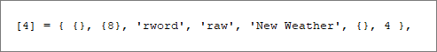

## TickerTape Version 1.0 (September 2024)

### Programmers' Guide

***Ticker Tape*** relies on two rules files to decode the packets to and from the server. This document explains how these rules files are constructed.

- /Data/RulesIn.lua
    - Definition of packets TO the client
###
- /Data/RulesOut.lua
    - Definition of packets FROM the client

These files can be edited (in an editor of your choice) to add new packets to the decode list, or to correct mistakes I may have made. In its simplest form, a packet rule is a lua table containing a sequence of nested tables of instructions that are executed in turn ... 
### 

###
## Overview

The rule is indexed as shown below, and while you can use decimal or hex I would recommend using the hex ID for the packet. Remember, there are many instances of a packet with the same ID being used (with different meaning) in both directions, so make sure you are working with the right packet, **in** or **out** ...
### 

###
Each line of the rule (each table) is executed in turn, from top to bottom (there are control sequence commands that are covered later). Each rule is organised such that the most important information, elements that are always present, are at the left of the table. This allows you to ignore elements at the end of the table that are not always needed. A FULL line is shown below ...
### 

###
This may look overwhelming, but going back to the original example ...
### 

###
This is used to display the line below ...
### 

###
The first table is empty (we have no special commands), the second table just contains the byte offset in the packet (0). We only want to access a single byte which is shown as a raw value (raw values are displayed in decimal and hex). Finally the caption, **Packet ID** tells the user what is being shown.

It is important that you make sure the line index is ...
- In order
- Has no gaps

This is a limitation of the way lua indexes tables, and yes, I know that I could fix this, and I may at some point, but for now use, [1], [2], [3] etc.

Anything in quotes (you can use single or double) is case sensitive. **ALL** commands are in lower case.

The rest of this guide explains how to construct the lines needed to decode a packet. There is a lot of information in this guide, so you can use this table of links for future access.
###
|Section|Detail|
|:---:|:---|
|[Data Offset](#data-offset)|How to identify the data in the packet we want to use|
|[Data Format](#data-format)|The bit, byte and word layout|
|[Data Decode](#data-decode)|How the data is interpreted|
|[Data Caption](#data-caption)|How the data is described|
|[Data Flags](#data-flags)|When one field affects a different field|
|[Data Tables](#tables)|When we have a list of possible data|
|[Extra](#extra)|Additional text display|
|[Flow Control](#flow-control)|Loops, Calls etc|

##
### Data Offset
### 

###
In most cases, such as in the original example, the offset into the packet is a single number, this can be expressed as decimal or hex.

There are cases where the entire byte or value is not used, in which case, there are two ways in which this section can be used to define the value to be used ...

- A single bit at a given bit offset within the data
- A group of bits from a given start bit

The type used is based on the **format** as shown in the following examples ...
### 

###
When the **format** is **bit** the offset is used to extract a single byte (at the specified offset) and the bit with the specific value is extracted from the byte ...
### 

###
Using bits as flags is covered later, but this example shows the *bit with the value 4* has been extracted from the byte (**NOT** the 4th bit).

The alternative use is when multiple bits need to be extracted from the middle of a byte or word, etc, and used as a number ...
### 

###
Here, a reverse word (little endian) is extracted from the data. The bottom 2 bits are discarded (shift right) and the next 4 bits are used as the value ...
### 

###
In this example, the two bytes are extracted to form the value 0x1618 or ...

-   0001 0110 0001 1000

The bottom 2 bits are discarded ...

-   00 0101 1000 0110

From which we take the bottom 4 bits to form our value ...
### 

###
When the **bits** decode the bits extracted are shown as a range like [02 ~ 05] above, meaning the value is constructed from bits 2 to 5 inclusive.
##
### Data Format
### 

###
The data format can be one of the following ...
###
- byte
    - a single byte is extracted at the given location
###
- word
    - two bytes are extracted starting at the given location and used in ***big endian*** format.
###
- rword (reverse word)
    - two bytes are extracted starting at the given location and used in ***little endian*** format.
###
- dword (double word)
    - four bytes are extracted starting at the given location and used in ***big endian*** format.
###
- rdword (reverse double word)
    - four bytes are extracted starting at the given location and used in ***little endian*** format.
##
### Data Decode
### 

###
While it is often enough to look at the raw value from the packet, sometimes it is helpful to see a decoded, or at least partially decoded interpretation of the data. The data **decode** can be one of the following, listed below in no particular order (an example can be seen by following the link) ...
###
|Type|Purpose|
|:---:|:---|
|[bool](#bool)|A series of bits shown as 1 or 0|
|action|An action performed by a player or NPC|
|[merit](#merit)|The name of a merit by its ID|
|[jpoint](#jpoint)|The description of an ability by its Job Point ID|
|[xyz](#xyz)|A location in +/- X, Y, Z|
|[item](#item)|An item name from its ID|
|[store](#store)|A storage location from its ID|
|[ip](#ip)|An IP address|
|vdate|A date in Vana'Diel|
|[entity](#entity)|An entity by its full ID|
|[eid](#eid)|An entity by its local ID/index|
|[job](#job)|A job / sub job based on ID|
|[dir](#dir)|A direction as an angle and text|
|[bits](#bits)|Extract a series of bits to form a new value|
|[craft](#craft)|A craft based on its ID|
|[string](#string)|A display string|
|[info](#info)|Decode information (user info)|
|[bluspell](#bluspell)|A BLU spell based on its encoded short ID|
|[attach](#attach)|An automation attachment name based on its Sub ID|
|[time](#time)|Decodes a counter as a time string|
|[psize](#psize)|Display the corrected packet size|
##
#### Examples ...
###

### bool
A **bool** type is usually used with a **flag**, flags are covered in a later section, this section explains how a bool is displayed.
### 

###
This sequence from the packet decode for an NPC update (packet IN 0x00E) contains 4 bit flags that identify which additional data in the packet is valid. If the specified bit (the bit with the stated value) is set then the **extra** data (a string) is shown in green, otherwise it is shown in grey ...
### 

###
The eight (8) bits are shown in order and are grey if not tested. If a bit is tested and it is set it is shown in green, if it is tested and it is not set then it is shown in red.
###

### merit
A **merit** type converts an ID into a textual description of that merit ...
### 

###
Merit IDs are decoded from an internal table. A merit will always be contain in a rword type.

### jpoint
A **jpoint** type converts an ID into a textual description of a job point and decodes its current state ...
### 

###
Job Points are decoded from an internal table and will always be contained in a rword type.

Job point IDs do NOT follow the same order that they are listed by the cient and so often appear "out of order" in the packet. The **Lv** or level shows how many points have been spent on that ability, **Next** shows how much the next upgrade will cost. If Next is 0 then the ability is fully upgraded.

### xyz
An **xyz** type takes the values in 12 consecutive bytes and converts them into 3 floating point numbers that represent X, Y and Z coordinates ...
### 

###
This is one instance where the stated data source format is ignored, I don't know the correct name for a triple reverse dword.

### item
An **item** type takes the values from the packet and looks up the item with that ID ...
### 

###
The information is extracted by making a call to the Ashita core.

### store
A **store** type typically takes a single byte and converts it into a storage location ...
### 

###
The location is converted using an internal lookup table.

### ip
An **ip** type takes four consective bytes and converts it into an IP address ...
### 

###
The address is commonly used by packets that are sent and received during the process of zone changing. It is commonly seen with the port address which is shown as a raw value ...
### 

###

### entity
An **entity** can be an NPC, or monster or even a pet. Its ID occupied a four byte rdword and this type converts this ID into a name ...
### 

###
NPCs are allocated a band of 4096 entries per zone, so the ID equates to the zone x 4096 plus an index in the range 0 ~ 4095. For reasons best known to SE you often see both in the same packet, even though the index could easily be extracted directly from the ID.

The name of the entity (if available) is found by calling the Ashita core.

### eid
An **eid** takes an "index in zone" and tries to find the ID of the entity ...
### 

###
This is not always possible, if it is, the name is shown, otherwise the ID is shown (as in the example above). If the **eid** yields a valid index it is identified via a call to the Ashita core.

### job
A **job** entry is always a single byte that is decoded into text ...
### 

###
A job and sub job are usually in the same packet and use the same decode. The job text is decoded from a local lookup table.

### dir
A **dir** entry is always a single byte that is decoded into the direction that a given entity is facing ...
### 

###
The direction is given as text and an angle. FFXI uses a system where 0 degrees is East and the angle is calculated clockwise.

### bits
A **bits** entry is subtly different from a bool type in that more that one bit is usually extracted to form the data ...
### 

###
In this instance 12 bits are extracted from the bottom end of the reverse word to form the current speed ...
### 

###

### craft
A **craft** entry decodes the craft skill type as text and extracts the current rank and level as numbers ...
### 

###

### string
A **string** entry takes a plain text string from the packet and displays it ...
### 

###
It's not clear why the client needs these strings, it doesn't display them as they are often truncated to save space.

### info
It is often useful to put a reminder in the packet definition that informs the user of an important aspect of the data ...
### 

###
In this example the user is informed that any value >= 0x8000 are capped ...
### 

###
When the data offset is -1 it is NOT shown, this provides a visual break in the list.

### bluspell
Some packets contain job specific information and BLU is no exception. When the job related packets are in BLU mode they save space by compressing the spell IDs (they reduce all spells by 0x200). In this mode the spell is unpacked and its name obtained from the Ashita Core ...
### 

###

### attach
Some packets contain job specific information and PUP is no exception. When the job related packets are in PUP mode they save space by compressing the attachment IDs (they reduce all items by 0x2100 and store the compressed Sub Item ID). In this mode the attachment is unpacked and its name obtained from a lookup table (Sub Items are not available from the Ashita Core) ...
### 

###
The unpacked Sub ID is also shows so that it can be looked up (if you have access to the SQL database).

### time
The **time** entry extracts the time played from a reverse dword ...
### 

###
Why this is needed to the ms is unclear.

### psize
The **psize** is unusual in that the packet size reported in the packet is wrong. Originally there were less than 256 packet IDs, meaning that the packet ID and the packet size could occupy two consecutive bytes. One day SE added a packet with an ID that would no longer fit in a byte and their solution was to steal the bottom bit from the packet size. As long as all packets were an even size (byte size divisible by 2) then the bottom bit could be removed, and the result shifted to give the correct packet size ...
### 

###

##
### Data Caption
### 

###
This is a name that describes the data to the user. If this is confusing you may want to pick a different hobby.

##
### Data Flags
### 

###
There are quite a few occasions where a bit flag is set in a packet that affects the validity of data later in the packet. This option allows you to set a flag based on data in the packet and later use this flag to change the way data is shown ...
### 

###
In this example you will notice in the top four lines each one sets a different flag based on a bit position. These are shown as follows ...
### 

###
Any bit that is set is shown in green, those that are not are shown in red.

Later in the packet there are position data fields that are validated by the flag on line 6 (see large box enclosed in red, lines 10 ~ 14). If the flag specified (we **use** 1) the data is shown as normal ...
### 

###
On line 8 we set a flag (flag 3) for the validity of the HP and status. As this flag was not set the bit display showed it in red.

When the data associated with this flag is shown (lined 16 & 17) the colour reflects the fact that the flag was not set ...
### 

###
The data is still visible, but it is (hopefully) obvious that it is not valid.
##
### Tables
### 

###
There are quite a few cases where the data is well known and organized into a convenient list. In these instances we can use one of the internal lists to decode the data ...
### 

###
### 

###
When data is shown from a table it is almost always shown with the original data first and the text on a second line.

The tables currently available are as follows ...

|Table ID|Contents|
|:---:|:---|
|1|Action Category|
|2|Action ID|
|3|Ability|
|4|Weather|
|5|Automation Head|
|6|Automation Frame|
##
### Extra
### 

###
The **extra** data is text that is shown at the end of a line, usually when bits are being decoded ...
### 

###
In this example **"Bit Flag"** is the **caption** and **"[Position etc]"** is the **extra** data.
##
## Flow Control
### 
There are several Flow Control commands that can be used to simplify the decode rules. Flow control commands are in the first table ...
### 

### 
These are explained in this section. For fast access you can follow the link below ...
###
|command|Purpose|
|:---:|:---|
|[if / ifnot](#if--ifnot)|Execute (or not) a single line|
|[call](#call)|Call another rule (as a sub routine)|
|[loop](#loop)|Repeat a list of rules a given number of times|
|[switch](#switch)|Execute one of several blocks of rules|
|[@](#cursor)|Move print cursor|
##
### if / ifnot
###
This is the simplest of the flow control commands. It allows you to ignore a rule based on the values in the packet ...
### 

###
This line, from the PUP decode section of a packet, will list up to 12 attachments, it is performed in a loop, which is covered a bit lower down. If the slot is empty I don't want to decode it and a) waste space, b) confuse the viewer.

The **ifnot** will check the value at byte 10 (the **offset**) and if it is not 0 (the check value in the command) the line will run, otherwise the code steps on to the next line.

Not surprisingly, the **if** works the opposite way, the line will run ONLY if the value in the packet matches the check value.
##
### call
###
This is the equivalent of a function call. I have used this where packet patterns repeat, such as wih the header ...
### 

###
Because there are no packets with IDs above **0xF00** I set function calls from **0xFFF** backwards.

The **0x00B** packet calls the **0xFFF** to decode the 4 bytes of the header, then returns to line 2 to continue decoding. This can save you a lot of time.

You must always include a **return** command at the end of the function or processing will stop.
##
### loop
###
A loop has a start **loop** command and an **end** command as shown below ...
### 

###
The value at **A** is the number of times the loop (the instructions between the **loop** and the **end**) will repeat, in this case a single line, line 6. The value at **B** is added to the byte offset of each line every time the end is reached. In this instance line 6 will be processed 20 times with an offset of 8, 9, 10, 11 etc.

The value at **C** is a BIT offset that can be added when you want to "walk down" a word, etc. In that instance you would probably set **B** to 0.

At this time it is NOT advisable to nest loops. This will be fixed in a future version.
##
### switch
###
The switch command works in similar manner to C in that it allows you to execute a single block of lines and provides a default for when a match is not found ...
### 

###
Packet 0x044 is a good example because it has 2 job specific sections (BLU/16 and PUP/18) and a catch all, the default, for all the other jobs.

The switch statement identifies the byte to check, and the size of the data, i.e. 1 = byte, 2 = word etc ...
### 

###
In this instance we are looking at a single byte at packet offset 4. This is quite common and byte 4 is often used as a **mode** byte.

The code next walks down the lines looking for **case** commands, specifically one that matches the byte extracted.

If a match is found, all lines after the **case** are executed until the matching **break** is found. Once the **break** is found the code will look for the matching **end** statement, in this instance on line 20.

If a match is NOT found and a **default** is encountered, the code will execute everything between the **default** and the matching **break**.
##
### cursor
###
I have OCD, it's not funny, I simply cannot tolerate when lists of things don't line up, so I have added the **@** command that allows you to start the decode X pixels into the line ...
### 

###
See how the two pieces line up nicely, just as they should.
##
---
### D'Hoffryn
Sept 2024